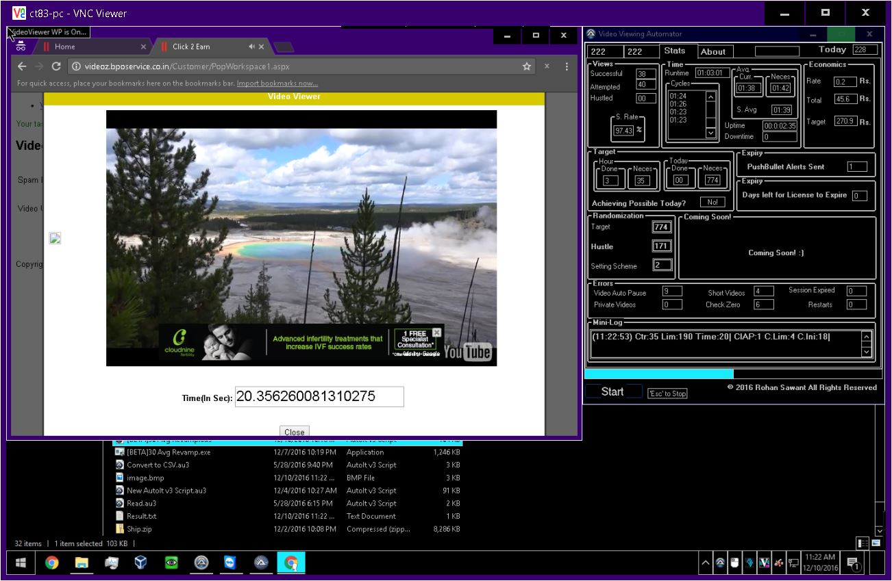

# Video-Viewing-Automator

 
<b>Introduction</b>
This AutoIt Application was written to automate the job of watching videos, selecting next videos (managing the network anomalies, change in network speeds) for a website which paid users to do so. 

April 2016 - Aug 2015 (6 Hours/Day)
September 2015 - December 2016 (3 Hours/Day)
  
<b>Vision</b>:
The project was aimed at automating a job which required 24x7 human interaction to something which was capable of running all on it's own with close to zero human intervention. 

<b>Result</b>:
<ul>
<li>It was a major success as it removed need of 3 Shifts of unskilled workers working 24x7.</li>
<li>Saved the company 33% in revenue</li>
<li>Increased efficiency by 50%</li>
<li>Eradicated the need of any Human Interaction</li>
whatsoever, dealing with powercuts and Internet Speed
drops on it's own.</li>
</ul>

Screenshots

 
<b>Libraries:</b>
<ul>
<li>Tesseract <i>for Character Recognition</i></li>
</ul>

  
<b>Tools:</b>
<ul>
<li>AutoIt Script Editor</li>
</ul>

 
 
<b>Conclusion</b>
After all the Stats Generation, and running successfully for a month the website went offline and turned out to be a scam and thus due to unavoidable circumstances the project failed to generate me any revenue, my efforts practically being futile; Though looking back, the experience I gained during the development of the application prepared me for my future projects.

